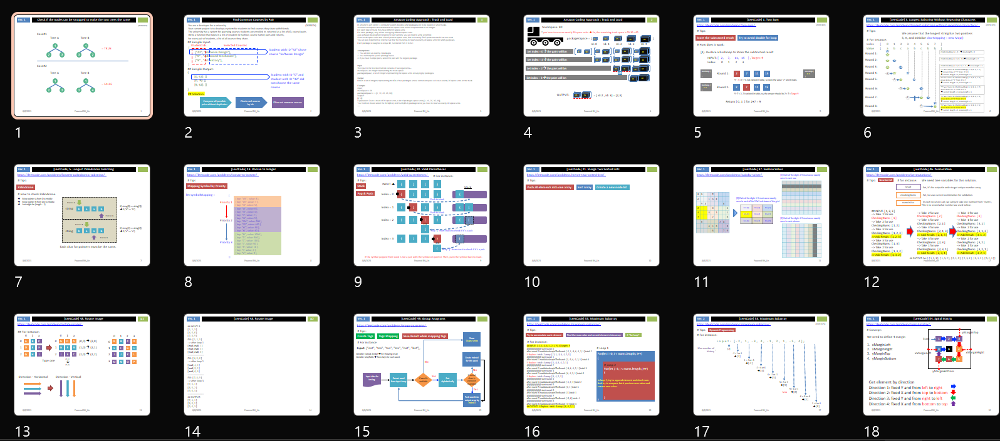

# 🚀 Coding Questions for Interview

Welcome to my repository of coding questions! I've taken on the challenge of solving these questions using various programming languages.

## 📂 Directory Structure

├── CPlusPlus  
├── CSharpApps  
├── Java  
├── androidapps  
├── kotlin  
├── leetcode  
└── rust  

> **Note:** Files in the root folder are primarily written in JavaScript.

## 📝 My Blog

For more insights, illustrations, and notes on coding questions, check out [my blog](https://theleetcode.blogspot.com/).

