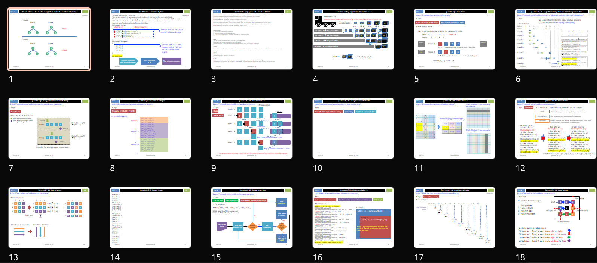

# 🚀 Coding Questions for Interview

Welcome to my repository of coding questions! I've taken on the challenge of solving these questions using various programming languages.

## 📂 Directory Structure

├── CPlusPlus  
├── CSharpApps  
├── Java  
├── androidapps  
├── kotlin  
├── leetcode  
└── rust  

> **Note:** Files in the root folder are primarily written in JavaScript.

## 📝 My Blog

For more insights, illustrations, and notes on coding questions, check out [my blog](https://theleetcode.blogspot.com/).

## 💻 Solutions in JavaScript

| File Name | Description |
| :---------- | :---------- |
| `a_game_of_battleship.js` | A solution for a battleship game to count sunk and hit ships. |
| `bubbleSort.js` | An implementation of the bubble sort algorithm. |
| `checkConditionAndOutput.js` | A function that checks for multiples of 3 and 5 and prints "FIZZ", "BUZZ", or "FIZZBUZZ". |
| `Circular_Printer.js` | A function that calculates the time to print a string on a circular printer. |
| `CodingQuestFromShopee.js` | A collection of coding questions from Shopee. |
| `createArrayOfFunctions.js` | A function that creates an array of functions. |
| `createNodesFromArray.js` | A function that creates a linked list from an array. |
| `deleteCharBySharpSymbol.js` | A function that deletes characters from a string based on the '#' symbol. |
| `factorial.js` | A function that calculates the factorial of a number. |
| `fibonacciNumbers.js` | A function that generates Fibonacci numbers. |
| `findADuplicateNumberInArray.js` | A function that finds a duplicate number in an array. |
| `findAValueInArray.js` | A function that finds a value in a 2D array. |
| `FindCommonCoursesByPairs.js` | A function that finds common courses between pairs of students. |
| `findMaxConsecutiveCharInString.js` | A function that finds the maximum consecutive characters in a string. |
| `findRelationshipCount.js` | A function that finds the number of relationships in a given set of pairs. |
| `findTheFirstCommonParentNode.js` | A function that finds the first common parent node in a binary tree. |
| `flatArray.js` | A function that flattens a nested array. |
| `get2ndMaxNumber.js` | A function that finds the second maximum number in an array. |
| `getFirstNonRepeatingChar.js` | A function that finds the first non-repeating character in a string. |
| `getFormulaToSum.js` | A function that finds a formula to sum up to a given number. |
| `getIntOneComplement.js` | A function that gets the one's complement of an integer. |
| `graph_traversal.js` | An implementation of graph traversal (BFS). |
| `how_many_words.js` | A function that counts the number of words in a sentence. |
| `isSubset.js` | A function that checks if an array is a subset of another array. |
| `linked_list_operation.js` | A collection of functions to operate on a linked list. |
| `longestSubArray.js` | A function that finds the longest subarray with a sum less than or equal to a given number. |
| `merge2SortedArray.js` | A function that merges two sorted arrays. |
| `nextFibonacci.js` | A function that finds the next Fibonacci number for each number in an array. |
| `OptimalFlightDistant.js` | A function that finds the optimal flight distance for a given set of forward and return routes. |
| `packageDifference.js` | A function that calculates the difference between two packages. |
| `prefix_uppercase.js` | A function that capitalizes the first letter of each word in a comma-separated string. |
| `printHourglass.js` | A function that prints an hourglass pattern. |
| `quickSort.js` | An implementation of the quicksort algorithm. |
| `randonEmemiesInMatrix.js` | A function that randomly places enemies in a matrix. |
| `rollTheString_v1.js` | A function that rolls a string based on a given set of rolls (version 1). |
| `rollTheString_v2.js` | A function that rolls a string based on a given set of rolls (version 2). |
| `rotate2dArray.js` | A function that rotates a 2D array. |
| `showMatrixByColumnRowSet.js` | A function that displays a matrix with a given number of columns and rows. |
| `sumByCombination.js` | A function that finds the sum by combination. |
| `truckAndLoad.js` | A function that finds two packages that fit into a truck with a given space. |
| `twoStackForQueueOperation.js` | An implementation of a queue using two stacks. |
